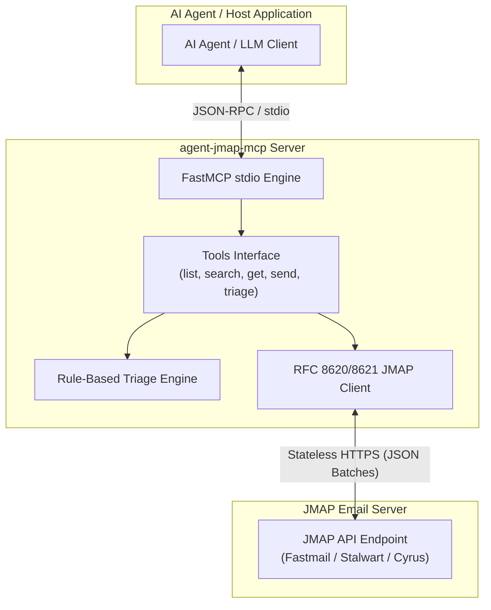

# agent-jmap-mcp

[](https://github.com/ericmaddox/agent-jmap-mcp/actions/workflows/ci.yml)
[](https://www.python.org/)
[](https://opensource.org/licenses/MIT)
[](https://modelcontextprotocol.io)
[](https://github.com/astral-sh/ruff)

A stateless, production-grade JSON Meta Application Protocol (JMAP) client and Model Context Protocol (MCP) server for AI agents, automation pipelines, and developer workflows.

Compliant with [RFC 8620](https://datatracker.ietf.org/doc/html/rfc8620) (JMAP Core) and [RFC 8621](https://datatracker.ietf.org/doc/html/rfc8621) (JMAP Mail), `agent-jmap-mcp` allows language models (e.g. Claude, Hermes Agent, GPT-4, Cursor) to inspect mailboxes, search and retrieve messages, perform automated inbox triage, and compose/send emails atomically over pure HTTP.

---

## Architecture



---

## Key Capabilities

- **Stateless HTTP Architecture**: Operates over standard HTTPS with bearer token authentication. Avoids persistent IMAP socket overhead and connection timeout state.
- **Atomic Operations**: Executes message creation and dispatch in a single atomic transaction combining `Email/set` and `EmailSubmission/set`.
- **Session Auto-Discovery**: Automatically queries `/.well-known/jmap` to discover API endpoints, upload/download URLs, and primary account IDs.
- **Zero-Footprint Model Context**: Optimized JSON payloads structured specifically for minimal LLM context window consumption.
- **Automated Inbox Triage**: Built-in heuristic classification for inbox sorting (Urgent, Action Required, Personal, Notifications, Newsletters).
- **Universal MCP Compatibility**: Plugs directly into Claude Desktop, Hermes Agent, Cursor, Zed, and any MCP-compliant environment.

---

## Installation

### Using uv (Recommended)

```bash
uv tool install agent-jmap-mcp
```

### Using pipx or pip

```bash
pipx install agent-jmap-mcp
# or
pip install agent-jmap-mcp
```

---

## Configuration

Set the required environment variables:

| Variable | Description | Example / Default |
| :--- | :--- | :--- |
| `JMAP_SESSION_URL` | JMAP Session discovery URL | `https://api.fastmail.com/.well-known/jmap` |
| `JMAP_API_TOKEN` | Bearer API token | `fmu1-...` |
| `JMAP_ACCOUNT_ID` | Optional target account ID | Auto-discovered from session if omitted |

A `.env.example` template is provided in the repository.

---

## MCP Server Integration

### Claude Desktop

Add to your `claude_desktop_config.json`:

```json
{
  "mcpServers": {
    "jmap": {
      "command": "uvx",
      "args": ["agent-jmap-mcp"],
      "env": {
        "JMAP_SESSION_URL": "https://api.fastmail.com/.well-known/jmap",
        "JMAP_API_TOKEN": "YOUR_JMAP_API_TOKEN"
      }
    }
  }
}
```

### Hermes Agent

Add to `~/.hermes/config.yaml`:

```yaml
mcp_servers:
  jmap:
    command: "uvx"
    args: ["agent-jmap-mcp"]
    env:
      JMAP_SESSION_URL: "https://api.fastmail.com/.well-known/jmap"
      JMAP_API_TOKEN: "${JMAP_API_TOKEN}"
```

### Cursor

Add to `.cursor/mcp.json`:

```json
{
  "mcpServers": {
    "jmap": {
      "command": "uvx",
      "args": ["agent-jmap-mcp"],
      "env": {
        "JMAP_SESSION_URL": "https://api.fastmail.com/.well-known/jmap",
        "JMAP_API_TOKEN": "YOUR_JMAP_API_TOKEN"
      }
    }
  }
}
```

### Zed Editor

Add to `settings.json`:

```json
{
  "context_servers": {
    "jmap": {
      "command": {
        "path": "uvx",
        "args": ["agent-jmap-mcp"],
        "env": {
          "JMAP_SESSION_URL": "https://api.fastmail.com/.well-known/jmap",
          "JMAP_API_TOKEN": "YOUR_JMAP_API_TOKEN"
        }
      }
    }
  }
}
```

---

## Available MCP Tools

| Tool Name | Parameters | Description |
| :--- | :--- | :--- |
| `jmap_list_mailboxes` | None | Returns metadata for all mailboxes (IDs, names, roles, unread/total counts). |
| `jmap_list_emails` | `mailbox` (str), `unread_only` (bool), `limit` (int), `query` (str), `from_addr` (str), `subject_contains` (str) | Queries email headers with filtering, search conditions, and sorting. |
| `jmap_get_email` | `email_id` (str), `mark_as_read` (bool) | Fetches full email body text, HTML, sender/recipient lists, and attachment metadata. |
| `jmap_send_email` | `to` (list), `subject` (str), `body` (str), `from_addr` (str), `cc` (list), `bcc` (list), `draft_only` (bool) | Atomically creates and submits an outgoing message (or saves to drafts). |
| `jmap_triage_inbox` | `mailbox` (str), `limit` (int) | Analyzes recent unread messages and returns categorization, priorities, and action items. |

---

## Command Line Interface (CLI)

The package includes a standalone CLI tool `agent-jmap`:

```bash
# Start MCP server over stdio
agent-jmap serve

# List available mailboxes
agent-jmap mailboxes

# List recent emails
agent-jmap list --limit 10
agent-jmap list --unread --query "invoice"

# View specific email
agent-jmap get <email-id>

# Run inbox triage
agent-jmap triage --limit 20

# Send email from command line
agent-jmap send --to user@example.com --subject "Status Update" --body "Processing completed."
```

---

## Development and Testing

### Setup Environment

```bash
git clone https://github.com/ericmaddox/agent-jmap-mcp.git
cd agent-jmap-mcp
uv sync --extra dev
```

### Running Test Suite

```bash
uv run pytest -v
```

### Code Formatting and Linting

```bash
uv run ruff check .
uv run ruff format .
```

---

## RFC Compliance

- [RFC 8620: The JSON Meta Application Protocol (JMAP)](https://datatracker.ietf.org/doc/html/rfc8620)
- [RFC 8621: The JSON Meta Application Protocol (JMAP) for Mail](https://datatracker.ietf.org/doc/html/rfc8621)
- [RFC 5322: Internet Message Format](https://datatracker.ietf.org/doc/html/rfc5322)

---

## License

MIT License. Copyright (c) 2026 Eric Maddox. See [LICENSE](LICENSE) for details.
