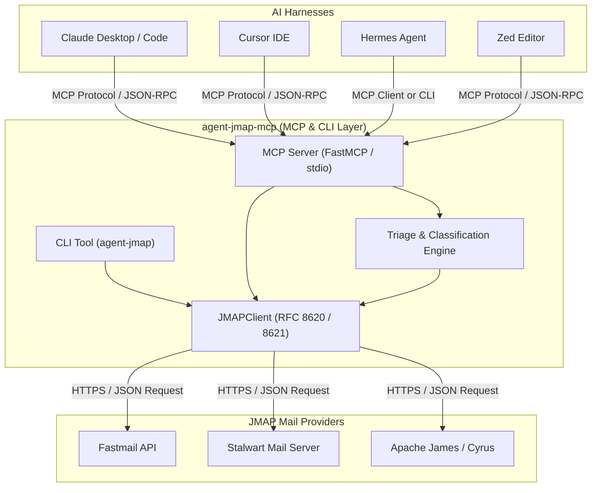

# agent-jmap-mcp

<div align="center">

[](https://github.com/ericmaddox/agent-jmap-mcp/actions)
[](https://pypi.org/project/agent-jmap-mcp/)
[](https://pypi.org/project/agent-jmap-mcp/)
[](https://opensource.org/licenses/MIT)
[-orange)](https://modelcontextprotocol.io)

**Modern, stateless JMAP email client and Model Context Protocol (MCP) server for AI agents, Claude, Cursor, and Hermes.**

[Features](#-key-features) • [Architecture](#-architecture) • [Quickstart](#-quickstart) • [MCP Configuration](#-mcp-configuration) • [CLI Usage](#-cli-usage) • [RFC Compliance](#-rfc-standards-compliance)

</div>

---

## 📌 Overview

**`agent-jmap-mcp`** is a high-performance, vendor-neutral email tool built natively on **JMAP (JSON Meta Application Protocol — RFC 8620 & RFC 8621)** and the **Model Context Protocol (MCP)**.

Unlike legacy IMAP/SMTP tools that suffer from socket lockups, stateful connection drops, and noisy parsing, `agent-jmap-mcp` operates over clean, stateless JSON/HTTP with **atomic email creation and submission in a single round-trip**.

Works natively with **Fastmail**, **Stalwart Mail Server**, **Apache James**, and Cyrus IMAP across any AI agent harness.

---

## 🚀 Key Features

- **⚡ Atomic Message Creation & Submission**: Executes `Email/set` and `EmailSubmission/set` in a single transactional JMAP request.
- **🔍 Fast Search & Structured Extraction**: Multi-criteria search (`hasKeyword`, `inMailbox`, `text`, `receivedAt`) with automatic HTML-to-text fallback and snippet previews.
- **🤖 Automated Inbox Triage**: Built-in intelligent classifier that parses subjects, headers, and previews to categorize emails (`urgent`, `action_needed`, `personal`, `notification`, `newsletter`) with priority ratings (1–5) and action item summaries.
- **🛡️ Fail-Closed Security**: Zero credential leakage, Bearer token isolation, and full environment variable gating.
- **🔌 Universal MCP Compatibility**: Instant integration with **Claude Desktop**, **Cursor IDE**, **Hermes Agent**, **Zed Editor**, and **OpenAI Assistants**.
- **💻 Rich CLI Included**: Full standalone CLI tool (`agent-jmap`) with formatted tables and JSON output modes.

---

## 🏛 Architecture



---

## 📦 Quickstart

### 1. Run without installation via `uvx`
```bash
# Run the MCP Server
uvx agent-jmap-mcp

# Or use the CLI
uvx --from agent-jmap-mcp agent-jmap --help
```

### 2. Install via `pip`
```bash
pip install agent-jmap-mcp
```

---

## ⚙️ MCP Configuration

Add `agent-jmap-mcp` to your client configuration:

### 🟣 Claude Desktop
Add to `claude_desktop_config.json`:
```json
{
  "mcpServers": {
    "jmap-email": {
      "command": "uvx",
      "args": ["agent-jmap-mcp"],
      "env": {
        "JMAP_SESSION_URL": "https://api.fastmail.com/jmap/session",
        "JMAP_API_TOKEN": "fmu1-your-fastmail-api-token"
      }
    }
  }
}
```

### 🤖 Hermes Agent
Add to `~/.hermes/config.yaml`:
```yaml
mcp_servers:
  jmap-email:
    command: "uvx"
    args: ["agent-jmap-mcp"]
    env:
      JMAP_SESSION_URL: "https://api.fastmail.com/jmap/session"
      JMAP_API_TOKEN: "fmu1-your-fastmail-api-token"
```

### 🟦 Cursor IDE
In **Cursor Settings > Features > MCP Servers > Add New MCP Server**:
- **Name**: `jmap-email`
- **Type**: `command`
- **Command**: `uvx agent-jmap-mcp`
- **Environment Variables**:
  - `JMAP_SESSION_URL=https://api.fastmail.com/jmap/session`
  - `JMAP_API_TOKEN=fmu1-your-fastmail-api-token`

---

## 🛠 MCP Tools Exposed

The server provides 5 high-level tools designed for autonomous agents:

| Tool | Parameters | Description |
| :--- | :--- | :--- |
| **`jmap_list_mailboxes`** | *None* | Discovers all folders/mailboxes (`INBOX`, `Sent`, `Drafts`, `Trash`, `Archive`). |
| **`jmap_list_emails`** | `mailbox`, `limit`, `unread_only`, `query` | Queries email headers with sender, date, preview snippet, and unread flags. |
| **`jmap_get_email`** | `email_id`, `mark_as_read` | Retrieves the full structured message body (plain text & HTML), headers, and attachments. |
| **`jmap_send_email`** | `to`, `subject`, `body`, `from_address`, `cc`, `bcc`, `draft_only` | Atomically creates and submits an email or saves to Drafts in a single request. |
| **`jmap_triage_inbox`** | `mailbox`, `limit`, `unread_only` | Parses, categorizes (`urgent`, `action_needed`, `personal`, etc.), and extracts actionable next steps. |

---

## 💻 CLI Usage

The package includes the `agent-jmap` terminal utility:

```bash
# Set your environment variables
export JMAP_SESSION_URL="https://api.fastmail.com/jmap/session"
export JMAP_API_TOKEN="fmu1-your-api-token"

# List all folders
agent-jmap mailboxes

# View unread emails in INBOX
agent-jmap list --unread --limit 5

# Read full content of an email
agent-jmap get <email_id> --read

# Run automated triage summary
agent-jmap triage --limit 10

# Send an email
agent-jmap send --to "team@example.com" --subject "Status Update" --body "Deployment complete."

# Save a draft
agent-jmap send --to "client@example.com" --subject "Proposal" --body "Draft notes..." --draft
```

---

## 📜 RFC Standards Compliance

- **[RFC 8620](https://datatracker.ietf.org/doc/html/rfc8620)**: The JSON Meta Application Protocol (JMAP Core Architecture).
- **[RFC 8621](https://datatracker.ietf.org/doc/html/rfc8621)**: The JSON Meta Application Protocol (JMAP Mail specification).
- **[Model Context Protocol](https://modelcontextprotocol.io)**: Anthropic MCP stdio specifications.

---

## 🧪 Development & Testing

```bash
# Clone the repository
git clone https://github.com/ericmaddox/agent-jmap-mcp.git
cd agent-jmap-mcp

# Install in editable mode with test dependencies
pip install -e ".[dev]"

# Run tests with coverage
pytest -v --cov=agent_jmap_mcp

# Lint codebase
ruff check src tests
```

---

## 📄 License

This project is licensed under the [MIT License](LICENSE).
